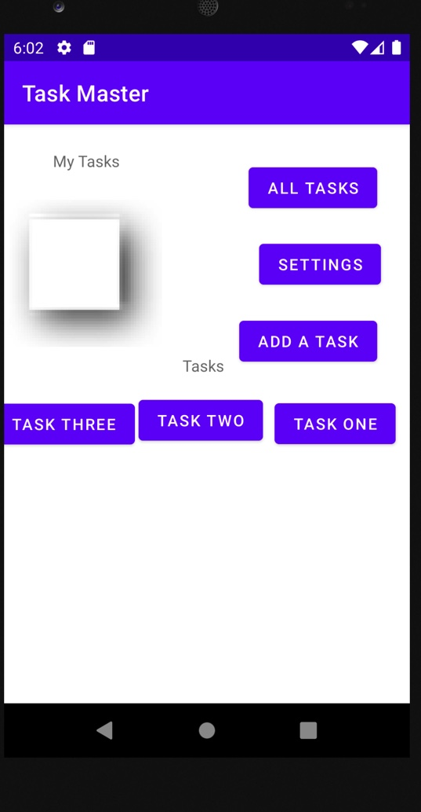

# Task Master
* This app has a home page, a add task page that allows you to add tasks, and a all task page to look at the tasks you have added.
* It also has a settings page where you can save your username, and a task detail page where you can look at your tasks in more detail.
* It also has clickable tasks listed on the home page.
* Add a task on the add task page, and it will be added to a list of tasks on the home page and on the task detail page.
* Can add team name on the settings page, and add can choose what team a task belongs to.

## Daily Change Log:

### Day 1 - Lab 26 Beginning TaskMaster
    * Setup
        - To start, create a new directory and repo to hold this app. Name it taskmaster.
        - Within that directory, use Android Studio to set up a new app, as discussed in class.
        - Create a README file that includes, at minimum, a description of your app and a daily change log.
    * Feature Tasks
        - Homepage
            * The main page should be built out to match the wireframe.
            * In particular, it should have a heading at the top of the page, an image to mock the “my tasks” view, and buttons at the bottom of the page to allow going to the “add tasks” and “all tasks” page.
        - Add a Task
            * On the “Add a Task” page, allow users to type in details about a new task, specifically a title and a body.
            * When users click the “submit” button, show a “submitted!” label on the page.
        - All Task
            * The all tasks page should just be an image with a back button; it needs no functionality.
    * Documentation
        - Create a directory called screenshots in the root of your project. Take a screenshot of the homepage you’ve created.
        - Use markdown to render the screenshot in your README.
    * Testing
        - In a future lecture, we’ll talk about how to test Android UI using Espresso.
        - For now, ensure that you’re writing good unit tests for anything unit-testable in your code.
    * Screenshots
        - 
        - 
        - 

### Day 2 - Lab 27 Data in TaskMaster
    * Feature Tasks
        - Task Detail Page
          * Create a Task Detail page. It should have a title at the top of the page, and a Lorem Ipsum description.
        - Settings Page
          * Create a Settings page. It should allow users to enter their username and hit save.
        - Homepage
          * The main page should be modified to contain three different buttons with hardcoded task titles. When a user taps one of the titles, it should go to the Task Detail page, and the title at the top of the page should match the task title that was tapped on the previous page.
          * The homepage should also contain a button to visit the Settings page, and once the user has entered their username, it should display “{username}’s tasks” above the three task buttons.
    * Screenshots
        - 
        - 
        - 
        - 

### Day 3 - Lab 28 RecyclerView
    * Feature Tasks
        - Task Model
         * Create a Task class. A Task should have a title, a body, and a state.
         * The state should be one of “new”, “assigned”, “in progress”, or “complete”.
        - Homepage
         * Refactor your homepage to use a RecyclerView for displaying Task data. This should have hardcoded Task data for now.
         * Some steps you will likely want to take to accomplish this:
          - Create a ViewAdapter class that displays data from a list of Tasks.
          - In your MainActivity, create at least three hardcoded Task instances and use those to populate your RecyclerView/ViewAdapter.
          - Ensure that you can tap on any one of the Tasks in the RecyclerView, and it will appropriately launch the detail page with the correct Task title displayed.
    * Screenshots
        - 

### Day 4 - Lab 29 Room
    * Feature Tasks
        - Task Model and Room
          * Following the directions provided in the Android documentation, set up Room in your application, and modify your Task class to be an Entity.
        - Add Task Form
          * Modify your Add Task form to save the data entered in as a Task in your local database.
        - Homepage
          * Refactor your homepage’s RecyclerView to display all Task entities in your database.
        - Detail Page
          * Ensure that the description and status of a tapped task are also displayed on the detail page, in addition to the title.
          * (Note that you can accomplish this by passing along the entire Task entity, or by passing along only its ID in the intent.)
    * Documentation
        - Update your daily change log with today’s changes.
    * Testing
        - Ensure that you have used Espresso to test relevant functionality of your application; for instance, tap on an item on the My Tasks page, and ensure that the correct details are rendered on the Detail page.
    * Screenshots
        - 
        - 
        - 
        - 

### Day 5 - Lab 31 Espresso and Polish
    * Feature Tasks
        - Espresso Testing
          * Add Espresso to your application, and use it to test basic functionality of the main components of your application. For example:
          * assert that important UI elements are displayed on the page
          * tap on a task, and assert that the resulting activity displays the name of that task
          * edit the user’s username, and assert that it says the correct thing on the homepage
    * Polish
        - Complete any remaining feature tasks from previous days’ labs.
    * Screenshots
         - 
         - 
         - 
         - 
         - 

### Day 6 - Lab 32 Amplify and DynamoDB
    * Overview
      - Today, your app will gain a scalable backend by using AWS Amplify. We’ll continue to work with Amplify to add more cloud functionality for the rest of the course.
    * Setup
      - Continue working in your taskmaster repository. Ensure that you have created an AWS account and installed the Amplify CLI, and follow the Amplify Getting Started directions to set up your application with Amplify.
    * Feature Tasks
      - Tasks Are Cloudy
        * Using the amplify add api command, create a Task resource that replicates our existing Task schema. Update all references to the Task data to instead use AWS Amplify to access your data in DynamoDB instead of in Room.
      - Add Task Form
        * Modify your Add Task form to save the data entered in as a Task to DynamoDB.
      - Homepage
        * Refactor your homepage’s RecyclerView to display all Task entities in DynamoDB.
    * Screenshots
      - 
      - 
      - 

### Day 7 - Lab 33 Related Data
    * Feature Tasks
       - Tasks Are Owned By Teams
         * Create a second entity for a team, which has a name and a list of tasks. Update your tasks to be owned by a team.
         * Manually create three teams by running a mutation exactly three times in your code. (You do NOT need to allow the user to create new teams.)
       - Add Task Form
         * Modify your Add Task form to include either a Spinner or Radio Buttons for which team that task belongs to.
       - Settings Page
         * In addition to a username, allow the user to choose their team on the Settings page. Use that Team to display only that team’s tasks on the homepage.
    * Screenshots
        - 
        - 
        - 

